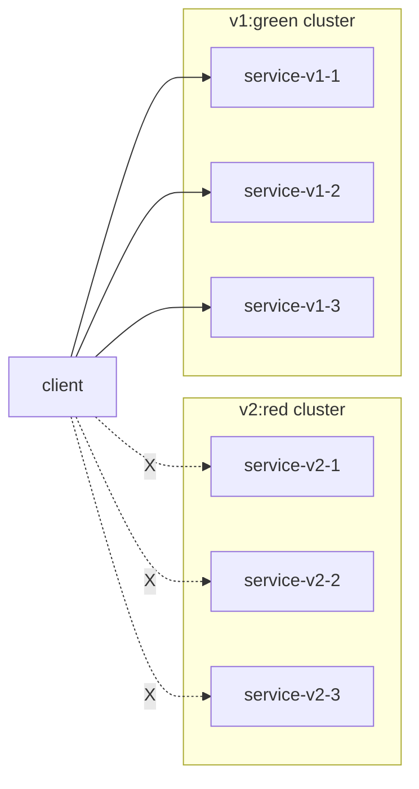
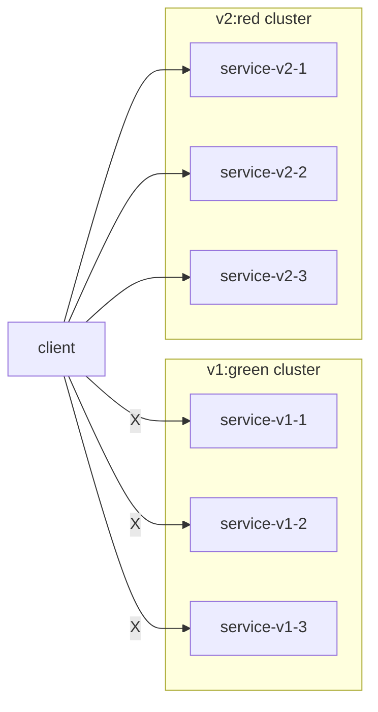
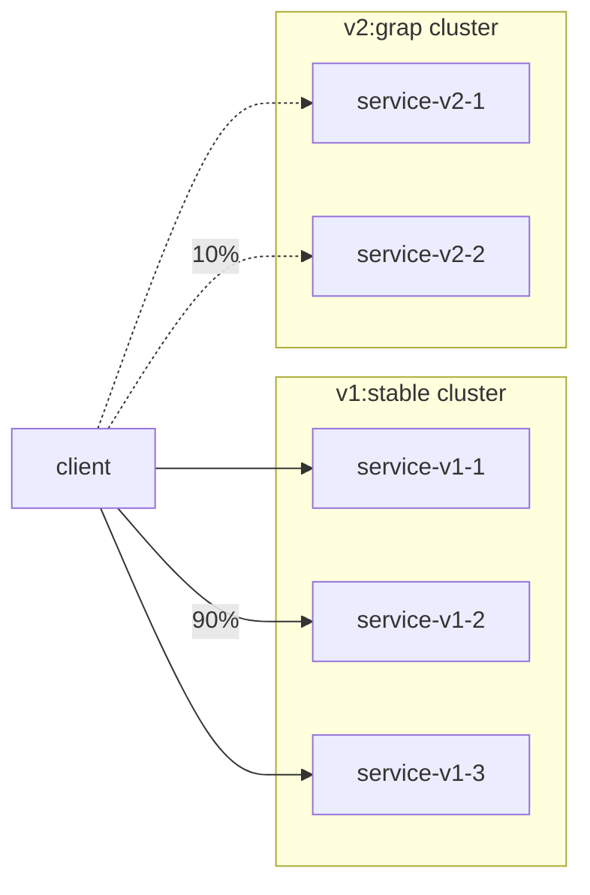

# 服务注册与发现

### 1. 服务定义

``` golang
type ServiceInfo struct {
	Name       string            `json:"name"`
	Scheme     string            `json:"scheme"`
	IP         string            `json:"ip"`
	Port       int               `json:"port"`
	Weight     float64           `json:"weight"`
	Enable     bool              `json:"enable"`
	Healthy    bool              `json:"healthy"`
	Metadata   map[string]string `json:"metadata"`
	Region     string            `json:"region"`
	Zone       string            `json:"zone"`
	Deployment string            `json:"deployment"`
}
```


### 2. 流量控制

#### 2.1 红绿发布

蓝绿发布，是在生产环境稳定集群之外，额外部署一个与稳定集群规模相同的新集群，并通过流量控制，逐步引入流量至新集群直至100%，
原先稳定集群将与新集群同时保持在线一段时间，期间发生任何异常，可立刻将所有流量切回至原稳定集群，实现快速回滚。直到全部验证成功后，
下线老的稳定集群，新集群成为新的稳定集群。


1. 部署新的集群, 但不接入流量

2. 将流量逐步导入v2集群，同时保持v1集群在线


验证失败，立即将流量切到v1集群。


#### 2.2 灰度发布

灰度发布，是在生产环境稳定集群之外，额外部署一个小规模的灰度集群，并通过流量控制，引入部分流量到灰度集群，进行生产全量发布前的灰度验证。
如果验证失败，可立刻将所有流量切回至稳定集群，取消灰度发布过程；如果验证成功，则将新版本进行全量发布升级至生产环境稳定集群，完成灰度发布过程。


            
蓝绿发布和灰度发布的各有优缺点，需要根据具体业务和资源成本自行选择。这里以灰度发布为例，讨论jupiter中对gRPC服务进行流量控制，从而实现灰度发布。

#### 2.3 Jupiter中对gRPC服务进行灰度发布


### 3. 服务注册

应用服务注册键的修改有两个场景:   
* 服务端注册、注销   
* 治理端更新   


为了保证在各个场景下的键修改安全，不同于一般的etcd键值更新方式：  
* 对于服务端注册、注销:  
    * 获取key锁成功，读取治理键，将治理键值合并到注册键。   
	* 获取key锁失败，等待1s重新注册。最多重试三次  
* 对于治理端更新  
	* 获取key锁成功，读取注册建，将治理键值合并写入，并单独写一个治理键。  
	* 获取key锁失败，由治理端用户触发重试  
	
该方式保证了：   
1. 多写端的键安全  
2. 注册键删除后，治理键依旧可用。重新注册后，治理配置不会丢失  
3. 兼容  

另外，app sider（一个单独的agent，与应用同机部署），提供了两个功能:  
1. etcdproxy, 代理etcd请求。最直观的优势是应用不再需要关心和配置etcd地址。  
2. healthcheck, 对同机的app做健康检查，判定应用不可用时，主动注销服务。理论上应用不在需要使用 etcd lease 保证异常状态下的服务正常注销。  

其中:
1. enable: 服务是否被客户端发现（即是否导入流量)
2. weight: 流量权重，客户端按照该权重配发流量
3. group: 流量分组, 多个分组使用','分隔

    
 
## 2 服务发现

### 2.1 负载均衡

常见的负载均衡算法有:  
    
> Round Robin： 轮询算法，顾名思义请求将会依次发给每一个实例，来共同分担所有的请求。    
> Random： 随机算法，将所有的请求随机分发给健康的实例。    
> Least Conn: 最小连接数，在所有健康的实例中任选两个，将请求发给连接数较小的那一个实例。    
> Weighted Round Robin: 加权轮询算法，根据服务器的不同处理能力，给每个服务器分配不同的权值，使其能够接受相应权值数的服务请求。    

针对流量分组的需求，naming在上述算法的基础上，实现了grpc.Resolver和grpc.Picker接口，提供基于分组和权重的负载均衡能力。  
目前，naming支持 __group weighted random__ 算法, 通过调节配置:  

> 单一分组内所有节点weight=1, 退化为组内Random算法。  
> 组名置空，退化为全局Random算法。  

之所以，使用Random而不是RoundRobin保底，原因是:  
    
> 1. 常见的RoundRobin算法也会在初始阶段，增加随机因子，保证后端负载压力均衡。与Random算法效果相似。  
> 2. 实现上，Random更简单  

### 2.2 实现  
 
naming.etcdResolver 实现了grpc.Resolver接口，相比etcdv3.GRPCResolver：  
  
> naming.etcdResolver 支持grpc.Balancer最新接口。相对的etcdv3.GRPCResolver已被标记为Deprecated.  

naming.groupPickerBuilder 实现了balancer.Builder接口，并向balancer包注入group_weight负载均衡器。


```go
// 服务发现
if len(options.iniConfig.EtcdEndpoints) > 0 {
    if resolver.Get("grpc") == nil {
        resolver.Register(naming.NewResolver("grpc", options.iniConfig.EtcdEndpoints))
    }

    options.dialOptions = append(options.dialOptions, grpc.WithBalancerName(naming.NameWeight))
}
// ...
cc, err := grpc.DialContext(
    ctx,
    "grpc:///" + options.iniConfig.Address,
    options.dialOptions...,
)
```


如注释行所述，发起调用的时候必须在context中写入_group, 用于表明请求的服务组。否则会退化为 __全局随机的负载均衡策略__。

_group的自动写入和匹配，在下一个版本中引入。

