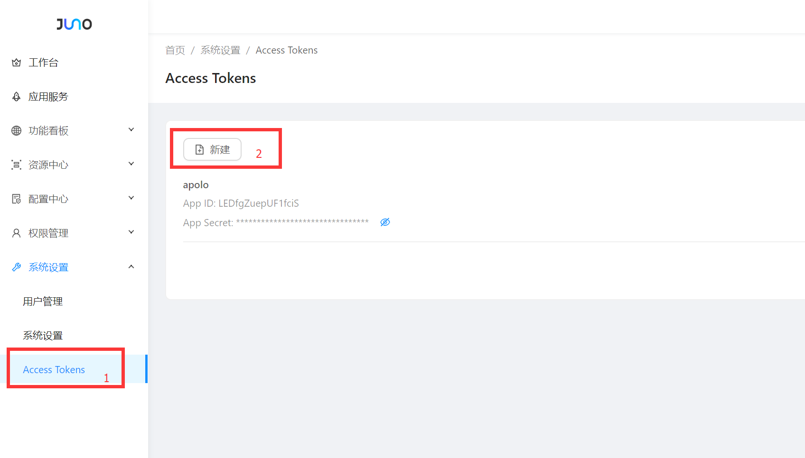
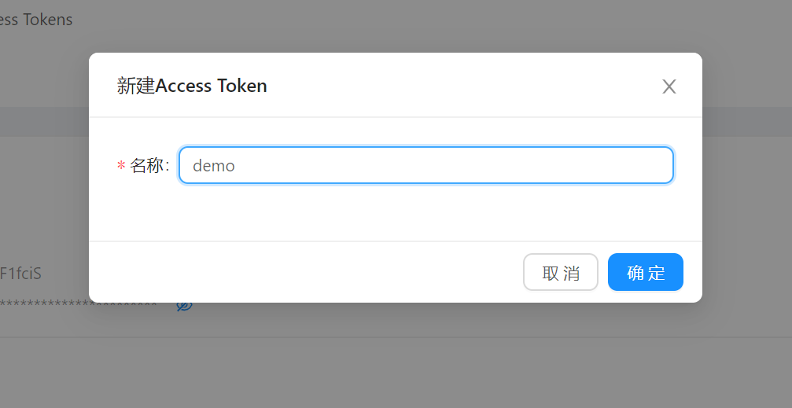
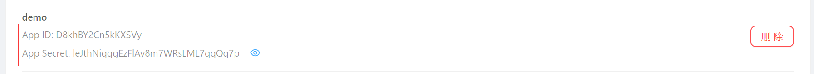

# 12.1 API 授权

## 12.1.1 创建一个 Access Token

1. 打开后台菜单: 系统设置 / AccessTokens，点击新建按钮



2. 输入授权应用名称



3. 创建成功后，点击小眼睛图表即可看到AppSecret


   
## 12.1.2 访问Open API

### 公共参数

所有Open API都需要携带如下公共参数：

| 参数名    | 类型   | 说明                                                         |
| --------- | ------ | ------------------------------------------------------------ |
| app_id    | string | 在Juno后台申请的App ID                                       |
| timestamp | int    | 当前Unix时间戳(秒)，如果Juno服务端收到过期的时间戳，授权失败 |
| nonce_str | string | 随机字符串，16位                                             |
| sign      | string | 签名                                                         |

如果是`POST`请求，那么以上参数在 `Body` 中，为 `JSON` 请求体的字段。如果是 `GET` 请求，以上参数为 `Query` 参数。


### 签名方法

1. 拼接签名原文

   签名原文由 `app_id`、`nonce_str`、`secret` 、 `timstamp` 组成，拼接方式如下:

   ```plainText = app_id + nonce_str+ secret + timestamp ```

2. 计算签名

   目前使用的签名算法是 `md5`，对签名原文使用md5进行签名即可:

   ```sign = md5(plainText)```


Go 语言示例：

```go
//计算签名
//md5(appId + nonceStr + secret + timestamp)
func openAuthSign(appId, nonceStr, secret string, timestamp int64) (sign string) {
	plainText := fmt.Sprintf("%s%s%s%d", appId, nonceStr, secret, timestamp)

	return util.Md5Str(plainText)
}
```


