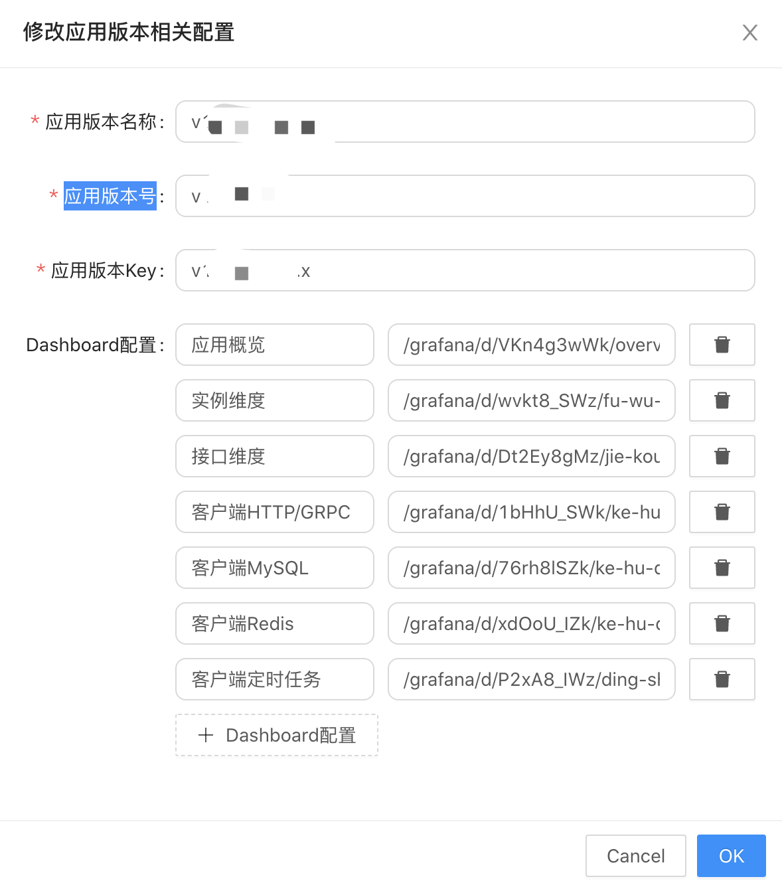
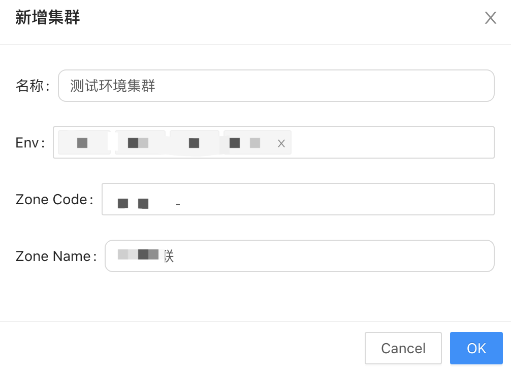

# 14.1 系统设置

介绍 JUNO 系统设置相关模块

## 14.2 Pprof 环境检测

检测服务 pprof 环境依赖，如果三个状态都是`已安装`，则可以正常使用应用服务中的 Pprof 分析功能。

## 14.3 配置依赖解析

调整配置依赖解析定时任务的时间间隔。

## 14.4 Grafana 设置

| 名称     | 类型   | 描述           |
| :------- | :----- | :------------- |
| `Host`   | string | 127.0.0.1      |
| `Scheme` | string | HTTP           |
| `Header` | string | X-WEBAUTH-USER |

## 14.5 网关设置

直接进行访问转发并条件对应的`headers`

## 14.6 Etcd 查询前缀设置

应用服务中 Etcd 查询下拉框中的默认值设定

## 14.7 应用版本设置

目的是为了兼容不同版本的 jupiter 版本，目前不需要进行多版本设置，后期如果出现了大版本更新，无法兼容历史版本，则需要新建一套配置。

| 名称           | 类型   | 描述                              |
| :------------- | :----- | :-------------------------------- |
| `应用版本名称` | string | 用户可读名称                      |
| `应用版本号`   | string | 关联应用依赖解析中 jupiter 的版本 |
| `应用版本Key`  | string | 系统内部使用                      |
| `Dashboard配置`  | string | 应用监控各个模板访问地址配置                      |

## 14.8 K8s 集群设置

指定机房和环境的集群设置。

