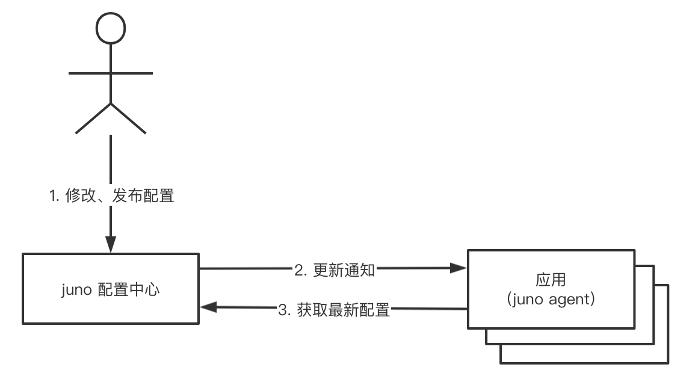
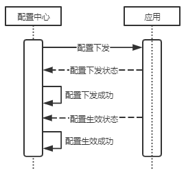
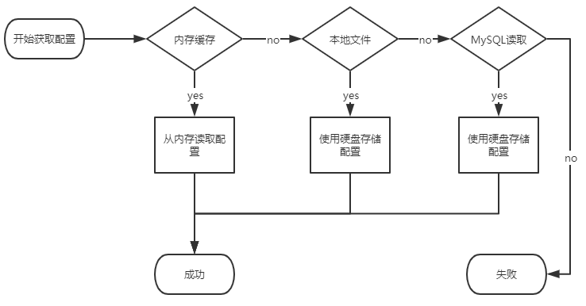

# 3.1 配置中心介绍

## 3.1.1 前言

    伴随微服务的推广，程序粒度的日趋小型化，配置文件的数量成几何级数增长，采用传统的本地文件方式管理应用，凸显的问题越来越多，很难适应于快速发展的微服务架构和容器虚拟化技术。我们需要对配置进行治理，能够对配置进行下发管理、版本管理、安全管理、权限管理等，因此斗鱼的配置中心应运而生。
  Juno配置中心是斗鱼研发的配置管理中心，集中化管理在不同机房、不同环境的应用配置，配置采用Key-Value 的数据结构，存储使用MySQL和ETCD，支持配置快速搜索，支持配置修改实时生效、 支持K8S 下使用配置中心、支持配置关系可视化等功能，适用于微服务的配置管理。

## 3.1.2 为什么需要配置中心

|   | 应用数量 | 配置数量 | 配置体积 | 变更频率 |
| --- | --- | --- | --- | --- |
| 单体应用时代 | 较少 | 较少 | 内容少 | 低 |
| 微服务时代 | 增多，机器节点增多 | 与应用数量呈正相关增加 | 增加大量依赖关系配置 | 变更频率远大于版本发布频率 |

         在单体应用时代，应用特点是：集成化、中心化、总量少；服务间依赖关系简单，较少考虑上下游依赖配置，迭代速度慢，配置变更频率低，只需要维护一个集成类型的配置文件，部署在数量可控的高性能机器上即可，遇到紧急情况可以让运维同事之间上机器操作便可以快速解决问题。     到微服务时代，应用开始进行功能化拆分，总量呈几何上升；采用低配置机器，注重弹性扩容，部署节点显著增多；更关注上下游服务相关配置，且配置文件的修改频率因为精细化操作、依赖管理等远高于代码本身的修改频率。 所有的这些麻烦是由于我们对配置和代码在管理和发布过程中不加区分造成的。配置本身源于代码，是为了提高代码的灵活性而提取出来的一些经常变化的或需要定制的内容，正是配置的这种天生的变化特征给我们带了很大的麻烦。 因此，在借鉴了业内其他分布式配置中心的设计和实现后，我们设计了下面的分布式配置管理系统，致力于将配置内容从代码中完全分离出来，及时可靠高效地提供配置访问和更新服务。  

## 3.1.3 主流产品差异性  

|   | 优点 | 缺点 |
| --- | --- | --- |
| QConf 方案 | 设计简单清晰 | 重度依赖 ZK 集群 横向扩展困难 |
| 淘宝 Diamond 方案 | 简单 可靠 易用 | 过于依赖 MYSQL 数据库 客户端性能存在瓶颈 高可用性受限 |
| 携程 Apollo 方案 | 基于 JAVA+Eureka 集群 多层负载，多级缓存保证高可用 权限管理，审计操作完善 | 设计复杂，部署维护成本高 |

    综合各种方案调研，考虑到现有的技术积累，在斗鱼实际业务场景中没有大规模使用ZK集群，实际服务部署架构上存在大量多机房部署的现象，我们希望配置中心：设计简单清晰；可靠易用；支持多机房高可用。携程的Apollo是不错的实现方案，功能完善设计完整。但是对斗鱼而言略显臃肿、维护成本高、对斗鱼的多机房架构和k8s结构支持不友好，所以我们必须要有一套更加适合斗鱼的配置中心。

## 3.1.4 配置中心理念

    配置中心有三个核心理念：配置完整性定义；配置下发回显功能；配置缓存优先级设计。

### 3.1.4.1 配置完整性定义

    配置完整性定义是：环境变量、编译注入配置、命令行配置、文本文件、远端配置，这五类数据共同构成了一份完整配置，形成一份完整配置。配置中心会对以下五类配置进行管理，涉及应用全生命周期的所有配置数据。

| 环境变量 | 运维初始化机器时或服务初次部署时定义的配置； |
| --- | --- |
| 编译注入配置 | 应用在源码编译过程中注入的配置； |
| 命令行配置 | 服务启动时写入的配置； |
| 文本文件 | 以文本方式更随服务或下发到服务的配置； |
| 远端配置 | 服务通过API获取到的远端配置； |

 
### 3.1.4.2 配置下发回显

    配置下发后会经过以下流程，保证配置下发成功。这是配置中心的核心所在，保证配置在跨机房下发过程中数据正常，保证服务能适应新版本的配置。

1. 下发配置，等待配置下发状态回传；
1. 等待配置生效状态监测；
1. 双重确认完成配置发布。

### 3.1.4.3 配置缓存优先级	

    应用程序向 Juno Agent 请求配置，优先返回 Juno Agent 内存缓存配置；其次是文件系统本地缓存；最后请求管理中心存储的持久化配置数据。如果整个流程走完没有获取到配置，则会在配置回显流程中产生错误提示，重新进入配置发布流程。保证如果有配置，应用一定可以获取到。

