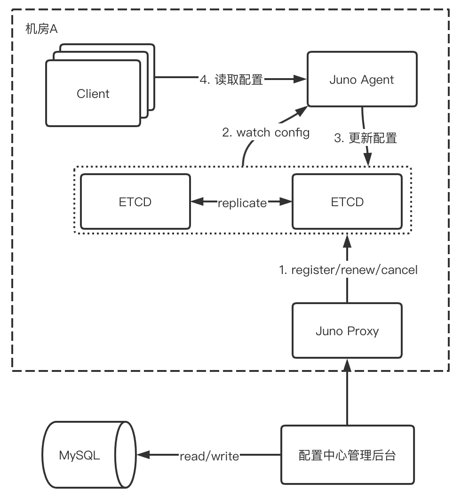
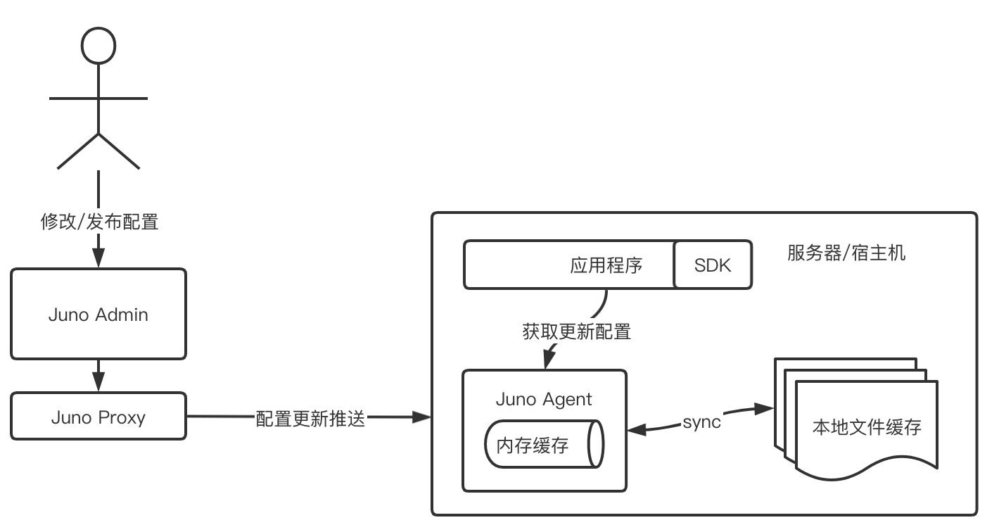
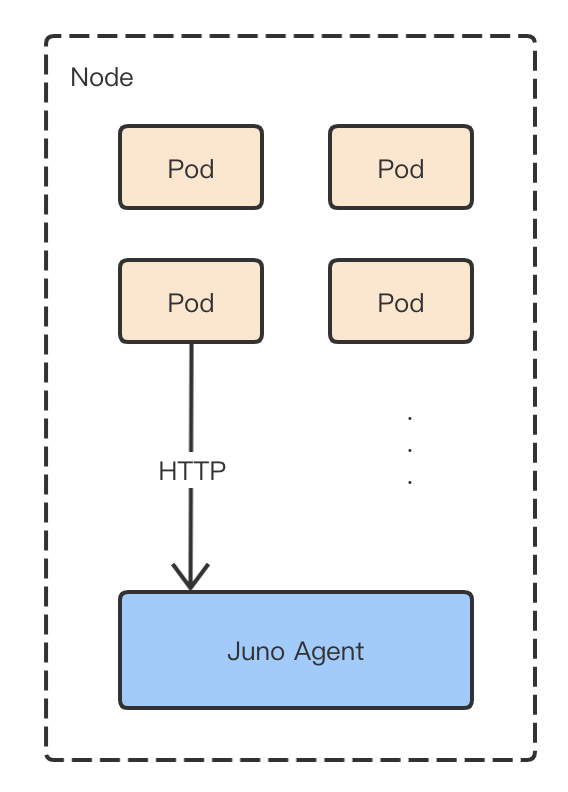

# 3.3 配置中心设计

## 3.3.1 关键概念

**应用（APP）**     客户端在运行过程中，Juno Agent 根据已有的应用属性从配置中心获取该应用对应的配置。应用的表示采用的是全局唯一应用名称。 ** **环境（ENV）**
配置对应不同的环境，Juno Agent 需要知道当前应用所属环境，根据环境获取对应的配置，获取环境的途径是根据环境变量而来。 ** **机房（IDC）**     跨机房配置集中化管理，例如我们的管理后台部署在机房 A，应用部署在机房 B 和机房 C，管理后台集中化管理各个机房的配置数据。
## 3.3.2 总体设计

### 3.3.2.1 层次设计

    下图描述配置中心的总体设计，从下往上分析：

- 配置管理中心提供了配置的修改发布功能，配置数据存入 MySQL 进行持久化；
- 配置管理中心通过 Juno Proxy 代理服务将配置发送到对应机房的 ETCD 中；
- 服务器或宿主机上部署的 Juno Agent 通过 Watch ETCD 获取到配置数据的变化，进一步调整硬盘以及内存中的配置数据；
- 客户端可直接读取 Juno Agent 更新的配置文件，也可以通过 API 直接获取配置数据。

### 3.3.2.2 客户端设计

    下图简要描述了配置中心客户端（Juno Agent）的实现原理：

1. 用户在配置中心进行配置新增或变更操作，在点击发布之后配置会同步到机房代理服务（Juno Proxy），再将配置数据写入机房内的ETCD中；
1. 客户端（Juno Agent）监听 ETCD 的数据变化来更新配置数据；
1. 客户端（Juno Agent）从配置中心获取到应用程序相关的最新版本配置文件后，更新本地的内存缓存；
1. 客户端（Juno Agent）在更新内存缓存的同时会在本地文件系统中缓存一份，在服务不可用或者网络故障时，让应用程序直接使用本地文件配置；
1. 应用程序从客户端（Juno Agent）获取最新的配置。

### 3.3.3.3 容器虚拟化方案设计

    虚拟容器化是大势所趋，配置中心对该场景有强大的技术支撑，设计思路是在宿主机中部署Juno Agent，保留整体层次结构，由Juno Agent对所有的pod提供配置支持，如下图所示。

1. Node 中部署 Juno Agent，以获取配置信息；
1. Pod 通过 API 借口获取当前应用的配置信息；

### 3.3.2.4 多机房方案设计

    Juno 配置中心支持多机房（IDC）统一管理，在实际场景中会同时使用多个地区的机房，机房之间不进行跨机房通信，所有的数据流转由某一个部署配置中心管理后台的机房完成，该机房依靠专线与其他机房进行通信，在遭遇专线网络故障时，可直接切换到外网IP保证服务稳定，对不同机房间的操作互相隔离，不产生依赖影响。 
## 3.3.2 技术点详解

### 3.3.2.1 配置推送实现

1. 配置通过 Juno Proxy 由管理后台推送到对应机房的 ETCD 中；
1. Juno Agent 监听 ETCD 数据变化，获取到更新的配置数据；
1. 配置数据在内存缓存和服务器/宿主机文件系统中更新。

 
### 3.3.2.2  配置时序图

    配置的整个生命周期流转如下图所示，归纳为四个配置点进行表述：管理后台（前端交互UI）、配置服务（管理后台服务）、下发服务（Juno Proxy+Juno Agent）、应用。   
### 3.3.3.3 兜底配置策略

    用户下发配置如果存在某些参数遗漏，例如MySQL或者Redis连接配置，用户对超时或者连接数没有配置，其中比较重要的就是超时，如果漏掉了会引发严重的线上问题，Jupiter SDK为了解决这个问题，开发了相关的兜底配置，对这些关键配置进行默认值补充。 
### 3.3.2.4 配置回显实现

    配置中心涉及配置下发后批量重启服务的执行流程如下，过程中强制配置回显，可保证配置下发状态和内容一定正确。 

1. 配置通过前一步的流程下发到应用程序；
1. Juno Agent 获取到配置数据之后，执行 Report 流程上报当前配置数据内容到配置中心；
1. 应用程序给配置中心上报服务运行版本，以及当前服务状态；
1. 配置中心接收到应用程序上报的版本符合下发版本，并且服务状态正常，便认可配置下发流程完成。

### 3.3.2.5 高可用性分析

    分析多故障场景，当前Juno配置中心的降级方案如下：

| 场景 | 影响 | 降级方案 |
| --- | --- | --- |
| 某台 juno-agent 挂掉 | 无影响 | juno-agent 无状态，客户端重连其他的 juno-agent |
| 全部的 juno-agent 挂掉 | 客户端无法读取 admin 配置的最新数据 | 客户端可以读取本地的文件缓存，新扩的机器可以从其他客户端获取缓存配置 |
| 某个 ETCD 节点挂掉 | 无影响 | juno-agent 可以重连其他 ETCD 节点 |
| 全部 ETCD 节点挂掉 | juno-agent 无法读取 admin 配置的最新数据，无法推送配置更新 | juno-agent 读取本地文件缓存提供给客户端 |
| AdminServer 挂掉 | 客户端无影响，admin 无法管理配置 |   |
| ConfigDB 宕机 | 客户端无影响，admin 配置的新数据无法持久化 |   |
| 专线故障 | 配置中心相关发布、回滚操作失败 | 使用公网 IP 继续相关操作 |

### 3.3.2.6 敏感配置信息

- 适度隔离：将敏感配置信息同源代码、普通配置信息隔离存储。
- 访问控制：通过白名单等方式，限制敏感配置信息的访问权限。
- 加密存储：将敏感配置信息加密后存储，仅在使用前临时解密，以进一步防止信息泄露。
- 安全传输：企业内网环境并非 100%可信，通过 HTTPS 等加密手段以保证敏感配置信息的传输安全。
- 日志记录：尽量详细记录下针对配置信息的操作，以便于事后追查或者合规审查。
- 差别配置：不同的环境（例如生产环境，灰度环境，开发环境等）使用不同的证书或秘钥，以避免“把鸡蛋放到一个篮子里”。

### 3.3.2.7  为什么选择 ETCD

    为什么采用 ETCD 作为服务注册中心和配置存储/订阅通知引擎，而不是使用传统的 ZK，Eureka？我们大致总结了一下，有以下几方面的原因：

- 它提供了强大和灵活的 K-V 存储能力，可以在保证性能的前提下对配置项进行最小粒度对存储
- 它提供了对 key 或者 key 前缀的监听功能，正好满足我们对某些配置项需要动态下发的需求
- 我们的项目本身就使用了 ETCD 做服务注册与发现和存储功能，维护和使用相对于 zk，Eureka 会熟练的多

### 3.3.2.8 为什么采用 GRPC

    为什么 Juno Agent 与 Client 之间的长链接通信我们采取 GRPCStream，而不是其他配置中心使用的 tcp 长链接，Http long polling？其实有下面一些考虑：

- 相比于自己搭建和维护一套 TCP 长链接服务，GRPCStream 是现成的解决方案，可以帮我们屏蔽底层的通信细节和长链接管理
- 相比于 Http long polling 服务器 hold 连接会消耗资源，GRPCStream 消耗更少的服务器资源
- 我们内部基于 GRPC 服务的开发体系已经很成熟了，当 client 很多时，可以轻松解决横向扩展的问题
- ETCDv3 本身也是 GRPC 实现的，可用性与可靠性比较有保证

###  3.3.2.9 其他场景

** **开关**     有时候 a 应用依赖 b 应用的新接口，但是 b 应用的发布时间点比较靠后，这时候 a 应用发布时可以加上一个默认关闭的开关，等 b 应用发布后再打开开关。有些新功能上线存在较高的风险，可以加个开关，一旦发现问题可以迅速关闭。   **限流**     一般的做法是在开关或 RPC 框架层添加限流逻辑，结合配置中心的动态推送能力实现动态调整限流规则配置。

**数据源迁移**     比如：需要将服务从 A 数据库迁移到 B 数据库，通过配置中心配置读写开关和比例配置，来达到动态读写数据库的操作，配合线下的旧数据补齐，平滑的完成数据迁移。

**动态日志级别**     服务运行过程中发生故障，我们一般会通过日志进行排查，如果 ERROR 日志查不出问题，一般需要打印 DEBUG 日志。相比于花费更多的时间去修改代码，发布部署应用，通过配置中心动态调整应用的日志打印级别显然更加安全和快速。
