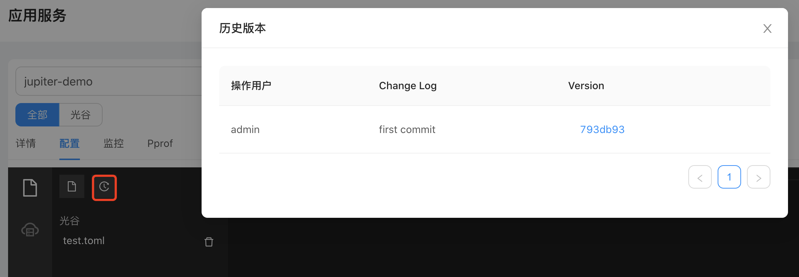

# 3.4 交互设计

## 3.4.1 基本交互

下图是配置中心的项目配置首页。

- 上方，进行应用环境切换
- 左侧，对当前应用的编辑操作；对当前应用的发布操作
- 右侧，配置的核心编辑区域
  

### 3.4.1.1 新建配置

选择目标环境，进行应用在对应环境进行操作，在选择环境后可以看到对应环境内相关的机房以及具体的配置文件。

如果没有选择环境，则无法选择机房，便不能新增配置。点击红框按钮进行配置新增。

### 3.4.1.2 配置编辑保存

点击配置文件，右侧可直接编辑，点击红框按钮进行保存，保存的时候填写当前修改信息。

### 3.4.1.3 配置提交记录

配置提交历史记录，点击Version可进行配内容比较。

### 3.4.1.4 配置发布

选择配置文件，点击发布按钮，选择对应的提交记录进行配置下发

### 3.4.1.5 配置使用

文件会下发到目标机器上，文件路径如下所示，直接使用即可

