# 4.2 Pprof

## 4.2.1 Pprof 是什么

在计算机性能调试领域里，profiling 是指对应用程序的画像，画像就是应用程序使用 CPU 和内存的情况。

Golang 是一个对性能特别看重的语言，因此语言中自带了 profiling 的库，在程序运行过程中可以获取 cpu、heap、block、traces 等执行信息。

Golang 中的性能优化主要有以下几个方面：

- CPU profile：报告程序的 CPU 使用情况，按照一定频率去采集应用程序在 CPU 和寄存器上面的数据

- Memory Profile（Heap Profile）：报告程序的内存使用情况

- Block Profiling：报告 goroutines 不在运行状态的情况，可以用来分析和查找死锁等性能瓶颈

- Goroutine Profiling：报告 goroutines 的使用情况，有哪些 goroutine，它们的调用关系是怎样的

## 4.2.2 Juno 中 环境依赖

* Profiling查看需要我们安装Juno的机器上拥有Golang Go-torch Graphviz环境，在应用服务-Pprof页面可以看到所需要的环境是否安装。
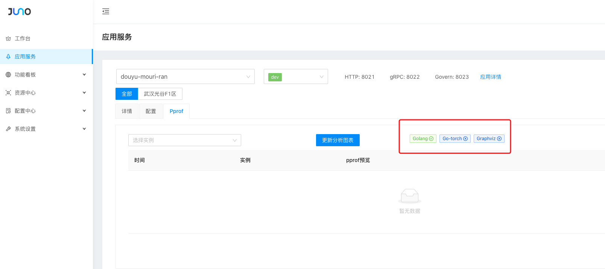
* 若发现有依赖项没有安装，我们需要到系统管理-系统设置里面去手动安装这些依赖项
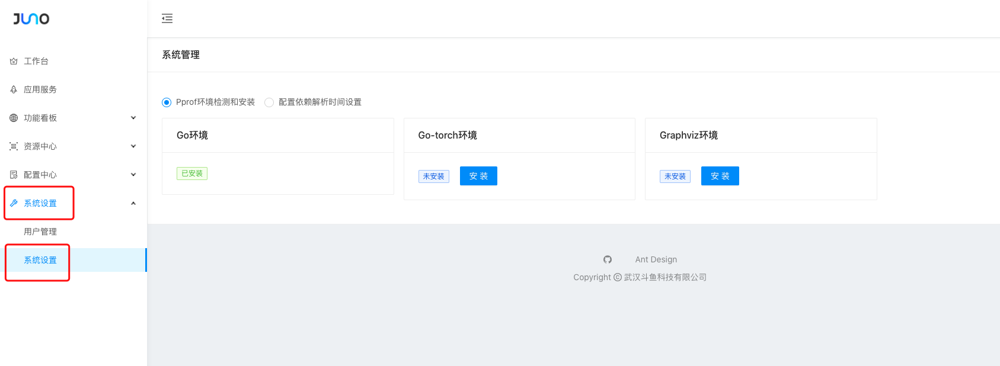

## 4.2.3 Juno 中 pprof 的生成和查看

在应用服务-Pprof 下我们可以方便的获取和查看应用在某个实例下的 profiling 数据以及火焰图

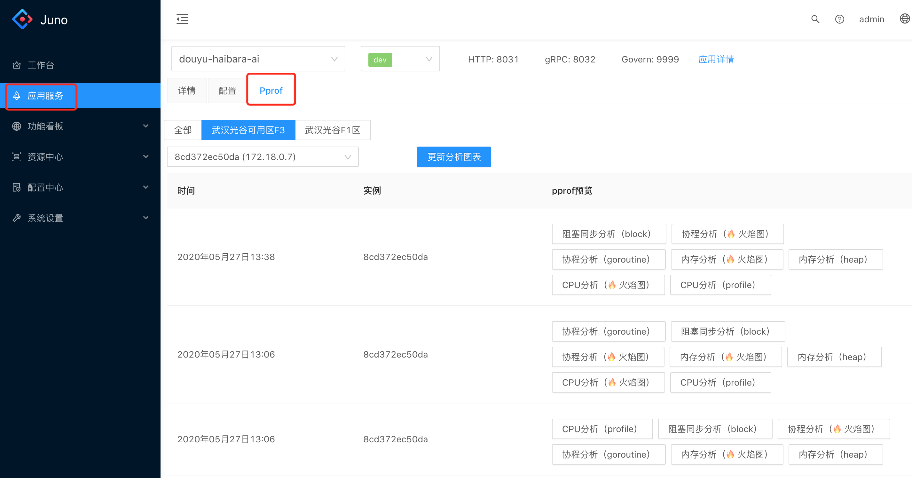

选择实例后点击更新分析图标我们可以获取该应用当前的 profiling 数据，并以 svg 格式展示出来，方便我们查看

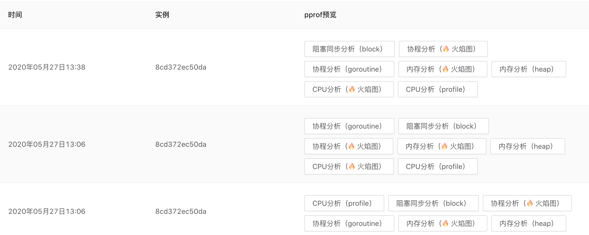

我们可以点击查看对应的 profiling 数据

- Goroutine 分析
  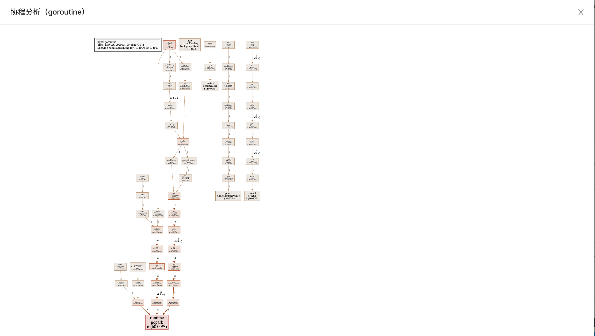

- Goroutine 火焰图
  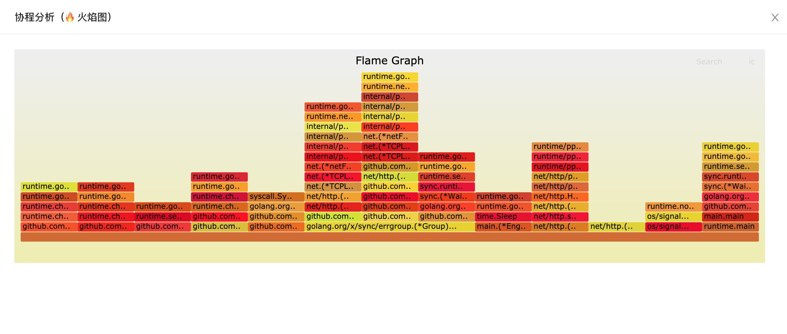

- Memory 分析
  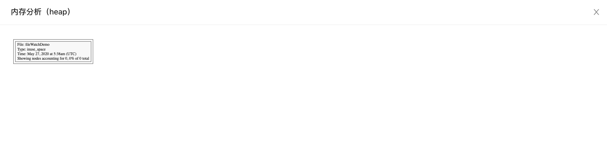

- Memory 火焰图
  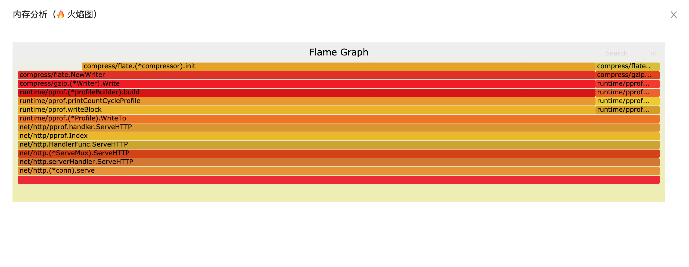

- Cpu 分析
  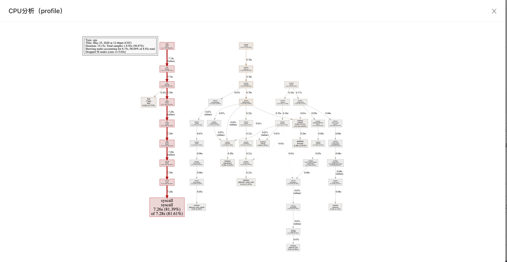

- Cpu 火焰图
  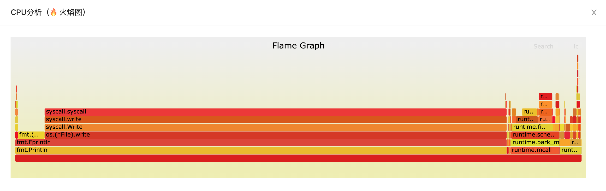

- Block 分析
  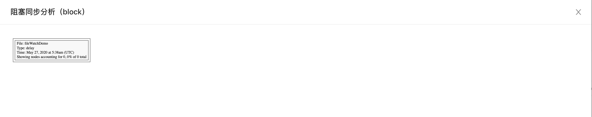
