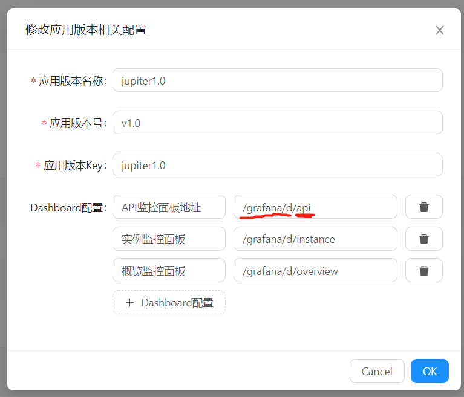

# 5.1 监控配置

## 5.1.1 流程
- [安装Grafana](#5.1.2 Grafana安装)，不限制版本，建议使用最新版
- [修改配置](#5.1.3 配置调整)，Grafana开始子域名访问与header头鉴权，开启iframe访问支持；Juno修改相应的配置
- [导入Dashboard模板](#5.1.4 导入Dashboard模板)
- [Juno系统设置](#5.1.5 Juno系统设置)

## 5.1.2 Grafana安装

按照官方文档安装即可  

[https://grafana.com/docs/grafana/latest/installation/debian/](https://grafana.com/docs/grafana/latest/installation/debian/)

```
sudo rpm -Uvh grafana-7.1.1-1.x86_64.rpm
```

## 5.1.3 配置调整

### 5.1.3.1 Grafana配置调整


```
root_url = %(protocol)s://%(domain)s:%(http_port)s/grafana

serve_from_sub_path = true

allow_embedding = true
```

其他的鉴权配置，例如：是否开启登录界面、是否支持匿名访问等，根据自己的需求来即可。

### 5.1.3.2 Juno文件配置

配置文件里面增加如下配置
```
[grafanaProxy]
  enable = true
  name = "grafana"
```

## 5.1.4 导入Dashboard模板

访问：`http://127.0.0.1:50000/grafana/`；


在仓库[路径](https://github.com/douyu/juno/blob/master/data/grafana)中，有三个配置好的dashboard配置文件。分别导入即可。

例如，此处，导入API-xxxxxx.json。


此处`uid`是文件中的配置项，同时，在Juno中，也是此dashboard的访问路径。

## 5.1.5 Juno系统设置


### 5.1.5.1 Grafana设置
进入管理后台：
系统设置——>系统设置


Host：Grafana实际访问的地址，只填写 `IP:PORT`，例如：`127.0.0.1:3000`。

```
X-WEBAUTH-USER
```

### 5.1.5.2 应用监控设置
`系统设置`页面下方，找到`应用版本相关设置`。

这里设计的目的是支持不同版本的监控Dashboard展示，一般情况下只需要配置一条记录即可。


- 应用版本名称，会在监控界面应用版本展示部分显示
- 应用版本号，指的是jupiter的版本，使用 `，`进行分割
- 应用版本key，目前配置应用监控版本的唯一标识，适用于Prometheus数据源指定

Dashboard配置，`/grafana/d/`为固定前缀，不得更改，`api`则是`dashboard`导入时，配置的`uid`。




