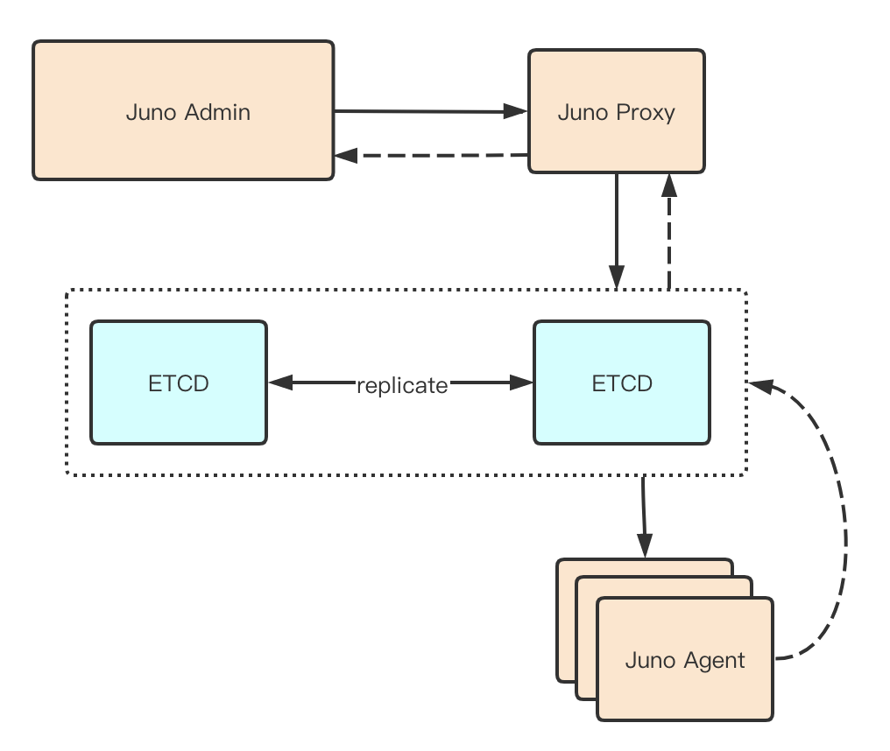
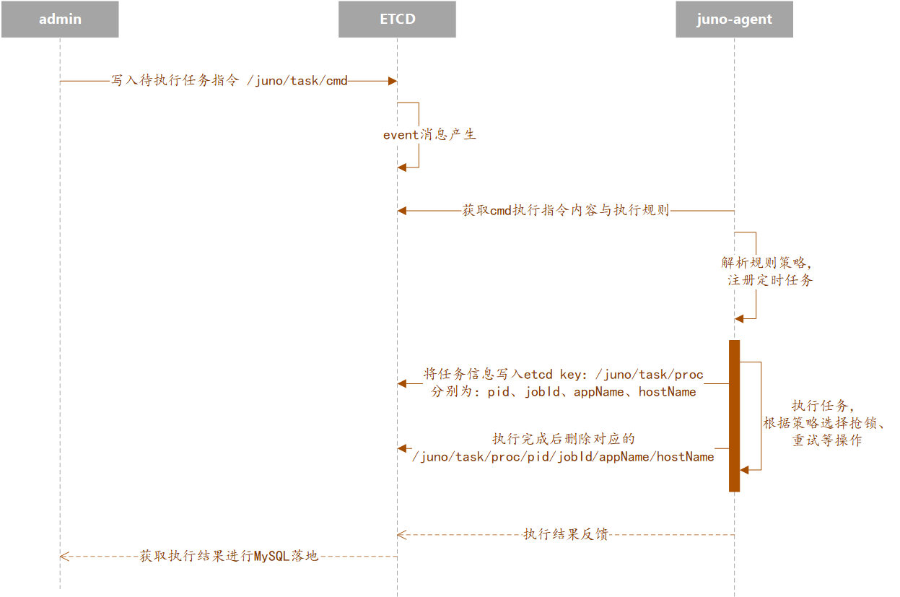
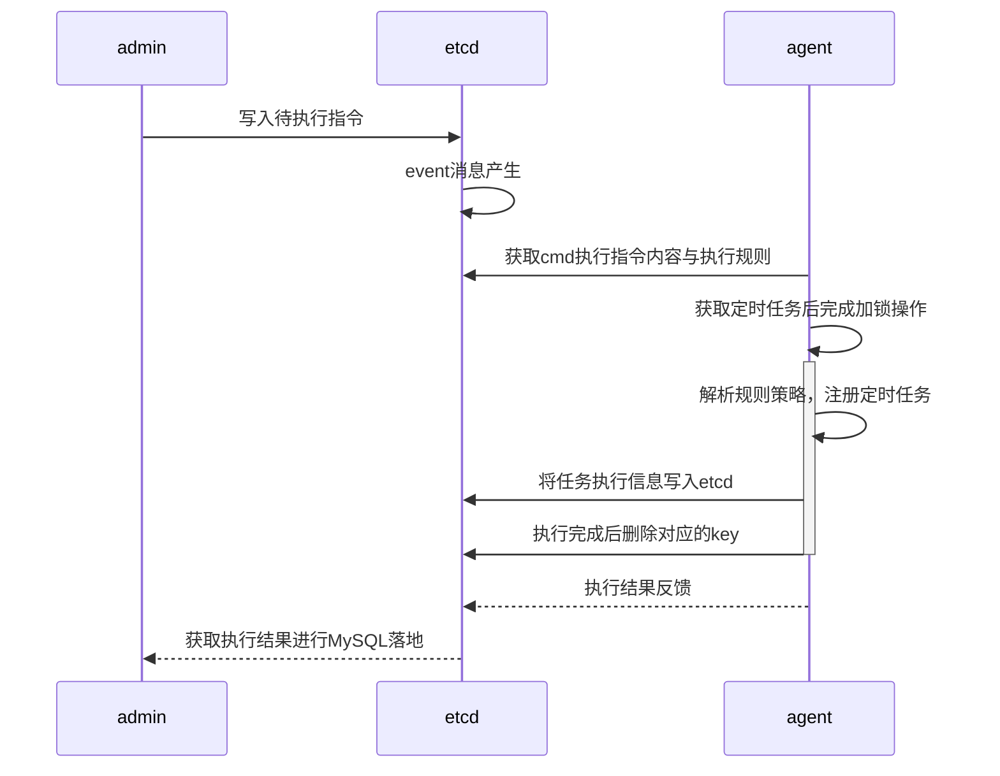
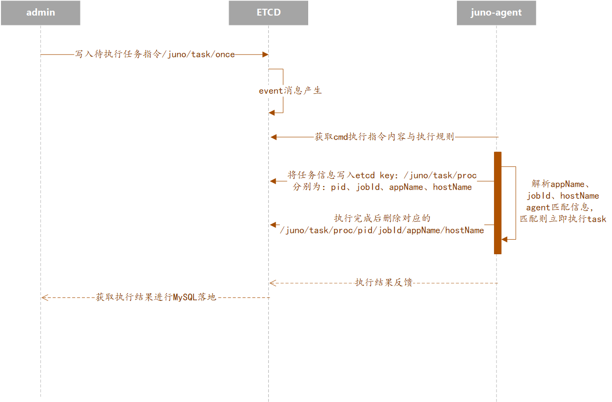
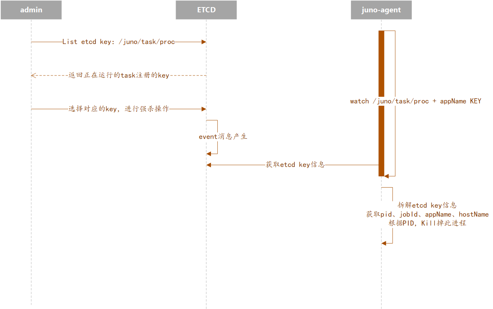

# 7.1 任务平台

juno-admin后台编辑编辑定时任务信息的时候，按组区分定时任务类别，组名即为应用名称，后面定时任务信息只会被应用所部属的机房消费到，并最终只有一台机器成功执行定时任务信息

有juno-admin后台统编辑带应用名的定时任务信息，并以应用名划分定时任务所在组。后台编辑好的定时任务信息在发布到etcd后，只会被任务信息所在的应用下的机房机器所消费到，机器得到消费的信息后，需要去获取锁，得锁者响应定时任务，未得锁者不响应定时任务。 这个锁可以用mysql的行锁+多版本去满足。

## 7.1.1 业内调研
- [XXL-JOB](https://www.xuxueli.com/xxl-job/#c%E3%80%81%E8%A7%A6%E5%8F%91%E4%BB%BB%E5%8A%A1)
- [cronsun](https://github.com/shunfei/cronsun)

## 7.1.2 架构设计



## 7.1.3 任务执行时序图

### 添加任务，执行任务





### 立即执行任务




### 强杀任务




## 7.1.4 业务流程

1. 由Agent心跳上报到Admin，Admin存储应用和agent的对应关系
2. 在Admin进行定时任务的逻辑处理，定时任务和应用强绑定，某个应用的定时任务执行逻辑指挥在对应的Agent上进行
3. 执行结果通过ETCD进行回调，再有Admin统一处理
4. 对异常执行任务进行重试

## 7.1.5 关键设计

```
/juno/task/proc/pid/jobId/appName/hostName  #关闭进程
/juno/task/cmd/appName/jobId # 任务下发
/juno/task/once/appName/jobId/hostName # 任务执行
/juno/task/lock/jobId # 执行锁
/juno/task/noticer/hostName # 执行结果通知
/juno/task/csctl/<cmd> # 临时指令
```

