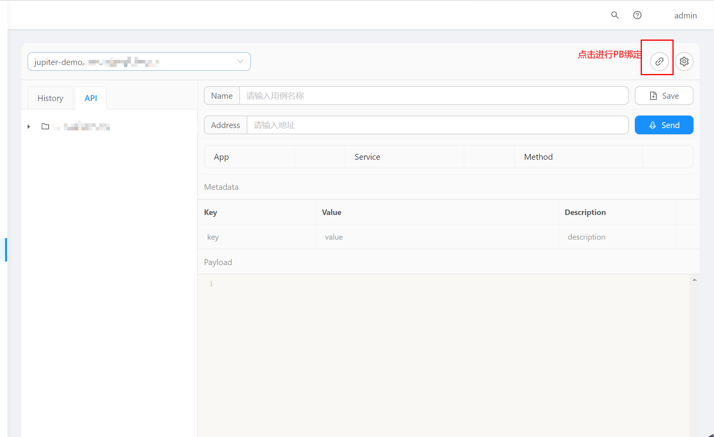
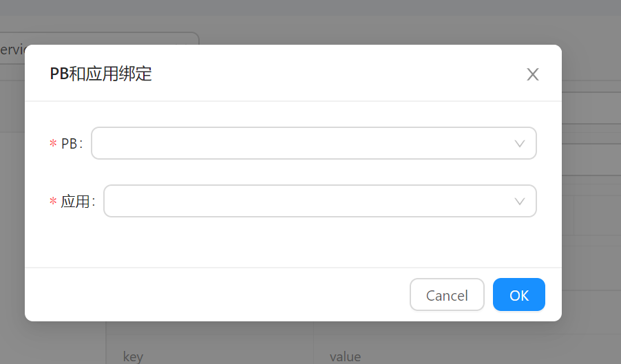
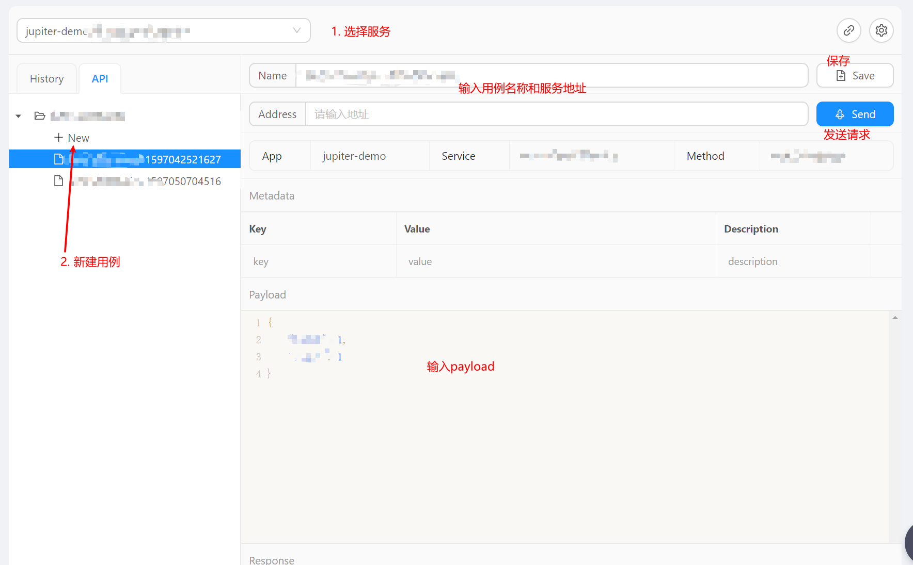

# 8.1 GRPC 测试

## 8.1.1 使用前提

1. 所有应用的PB文件必须集中管理

2. 使用本功能前，需要在 `juno` 的配置文件中设置 `pb` 文件的根文件夹（该文件下所有PB文件会被 `juno` 系统解析）

    ```toml
    [grpcTest]
    enable = true               # 开启Grpc 测试功能
    protoDir = "/path/to/pb"    # PB文件的目录
    ```

3. 重启 `juno`
    
    重启后，`juno` 会解析文件夹下所有的 `pb` 文件，启动后解析需要一段时间。
    
    `juno` 会监听 `pb` 目录的文件事件，当该文件夹下发生修改时，进行自动解析。通过这个特性，用户可以使用代码托管平台的发布事件进行 `pb` 文件的自动发布，进而触发 `juno` 的自动文件解析。

## 8.1.2 关联应用到 PB

解析完毕后，用户需要在 `测试平台 > GRPC测试` 页面将 `PB` 文件绑定到应用:

1. 点开应用绑定窗口


2. 选择 PB 和应用进行绑定


## 8.1.3 使用

