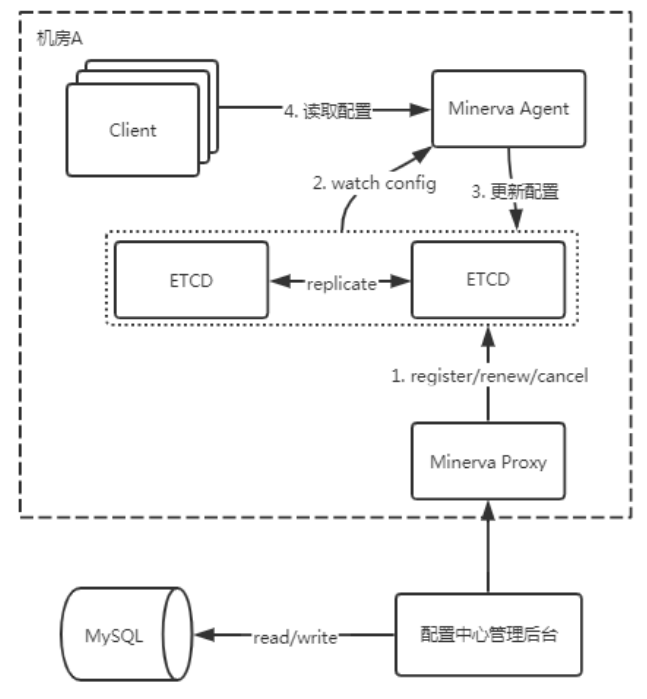

# 9.4 应用配置下发
应用配置是结合``confgo``一起使用。

## 9.4.1 配置下发流程
配置下发流程如下所示

* 用户在Juno配置中心进行配置新增或变更操作，在点击发布之后配置会同步到机房代理服务（Juno Proxy），再将配置数据写入机房内的ETCD中；
* 客户端（Juno Agent）监听 ETCD 的数据变化来更新配置数据；
* 客户端（Juno Agent）从配置中心获取到应用程序相关的最新版本配置文件后，更新本地的内存缓存；
* 客户端（Juno Agent）在更新内存缓存的同时会在本地文件系统中缓存一份，在服务不可用或者网络故障时，让应用程序直接使用本地文件配置；
* 应用程序从客户端（Juno Agent）获取最新的配置。
* 客户端（Juno Agent）维护应用配置的关系，通过长轮询，用户可以实时获取应用最新配置
