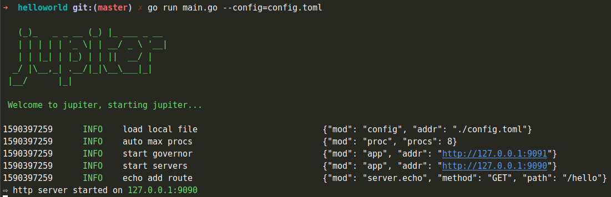

# 1.1 快速开始

为了让大家快速了解``Jupiter``框架，我们提供了大量的[example](https://github.com/douyu/jupiter-examples)

在这一节，我们参考[helloworld示例](https://github.com/douyu/jupiter-examples/tree/main/helloworld)带领大家入门

```go
package main

import (
	"github.com/douyu/jupiter"
	"github.com/douyu/jupiter/pkg/server/xecho"
	"github.com/douyu/jupiter/pkg/xlog"
	"github.com/labstack/echo/v4"
)

func main() {
	eng := NewEngine()
	if err := eng.Run(); err != nil {
		xlog.Error(err.Error())
	}
}

type Engine struct {
	jupiter.Application
}

func NewEngine() *Engine {
	eng := &Engine{}
	if err := eng.Startup(
		eng.serveHTTP,
	); err != nil {
		xlog.Panic("startup", xlog.Any("err", err))
	}
	return eng
}

// HTTP地址
func (eng *Engine) serveHTTP() error {
	server := xecho.StdConfig("http").Build()
	server.GET("/hello", func(ctx echo.Context) error {
		return ctx.JSON(200, "Gopher Wuhan")
	})
	return eng.Serve(server)
}
```

我们在``main.go``里创建一个``Engine``，然后将``serveHTTP``和``serveGovern``设置到``Engine``。
``Jupiter``会根据我们的配置``schema``解析配置文件，并根据``Engine``注入功能的生命周期，提供HTTP服务和治理服务。

我们运行指令``go run main.go --config=config.toml``，可以看到以下提示


这个时候我们可以发送一个指令，得到如下结果
```bash
~ curl http://127.0.0.1:9090/hello
~ "Gopher Wuhan"
```

我们还可以观测我们应用的治理信息
```bash
~ curl http://127.0.0.1:9990/routes
~ ["/routes","/debug/pprof/","/debug/pprof/cmdline","/debug/pprof/profile","/debug/pprof/symbol","/debug/pprof/trace","/modInfo","/configs","/status/code/list","/metrics"]
```

我们可以继续访问这些路由，能够获取到我们应用的编译、依赖、配置、监控等信息。具体请查看[服务治理](../jupiter/5.1governintro.md)

目前我们只能够简单的通过``HTTP``获得治理信息，二期我们开源更多的治理信息数据、并会将这些治理信息数据进行可视化，敬请期待。


