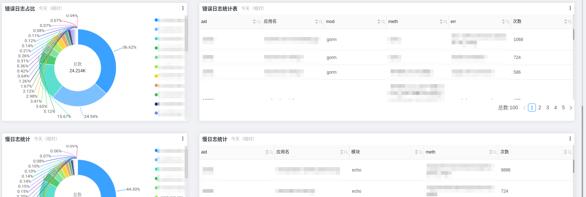
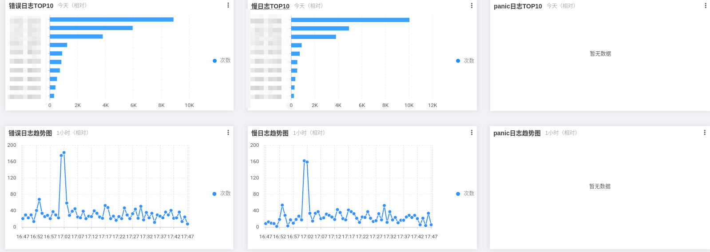
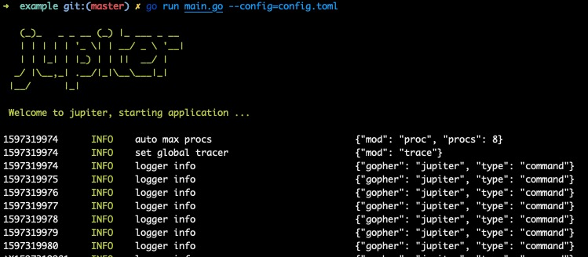

# 2.3 日志

## 2.3.1 日志介绍
日志定义： 系统日志、框架日志、业务日志。系统日志采集应用的启动、运行、error、panic等信息。框架日志采集应用内部组件的启动、运行、error、panic、应用access、job等信息。业务日志采集业务相关信息。

### 日志性能
* sugar版本
* 高性能版本

### 日志级别
* debug
* info
* warn
* error
* panic

### 日志字段
* lv 日志级别
* ts 时间戳
* msg 日志信息
* aid 应用id
* iid 应用实例id
* tid 请求trace id

## 2.3.2 配置规范
[配置说明](../jupiter/6.1logger.md)

## 2.3.3 框架日志
我们规范了框架日志，定义了十多个字段用于收敛框架的日志行为。参考于[opentrace](https://github.com/opentracing-contrib/opentracing-specification-zh/blob/master/semantic_conventions.md)。

|  名称 | 类型 | 描述 |
|:--------------|:-----|:-------------------|
|`lv`| string| 日志级别|
|`ts`| string| 时间戳|
|`msg`| string| 日志信息|
|`aid`| string| 应用id|
|`iid`| string| 应用实例id|
|`tid`| string| 请求trace id|
|`color`| string| 染色|
|`mod` | string  | 类库或模块。如 `"grpc"`, `"http"`, `"redis"`. |
|`addr` | string | 依赖的实例名称。以mysql为例，`"dsn = "root:juno@tcp(127.0.0.1:3306)/juno?charset=utf8"`，addr为 `"127.0.0.1:3306"`. |
|`cost` | int | 耗时时间 |
|`code` | int | 用户侧响应的状态码 |
|`meth` | string | 对于`redis`是`command`、对于`http`是`url`、对于`mysql`是`sql` |
|`host`| string | 主机名 |
|`ip`| string | 主机IP |
|`peerAid`| string | 对端应用id |
|`peerHost`| string | 对端主机名 |
|`errKind`| string | 错误类型，用于收敛 |
|`err`| string | 错误信息 |

定义合理的日志schema，我们可以将框架日志全部采集到一个``logstore``里进行分析和报警。如图所示



因为开源时间紧迫，并未将内部收敛的迁移到开源项目中，二期我们将会把这些治理理念放入到框架中，尽情期待。

## 2.3.4 业务的命令行日志
参考[日志终端展示示例](https://github.com/douyu/jupiter-examples/tree/main/logger/command)
```toml
[jupiter.logger.default]
    debug = true          # 是否在命令行输出
    enableConsole = true  # 是否按命令行格式输出
```
```go
xlog.DefaultLogger = xlog.StdConfig("default").Build()
for {
    xlog.Info("logger info", xlog.String("gopher", "jupiter"), xlog.String("type", "command"))
    time.Sleep(1 * time.Second)
}
```
在线下调试代码的时候，我们可以开启``debug=true``的选项将日志信息输出到终端，并且打开``enableConsole=true``，就可以看到高亮的日志信息，更加方便我们排查日志。运行``go run main.go --config=config.toml``，可以看到以下运行结果。



## 2.3.5 业务的文本日志
参考[日志文本展示示例](https://github.com/douyu/jupiter-examples/tree/main/logger/file)
```toml
[jupiter.logger.default]
    debug = false         # 是否在命令行输出
    enableConsole = false # 是否按命令行格式输出
    name = "default.json" # 日志名称
    dir = "."             # 日志路径
    async = true          # 默认异步采集日志
```
```go
xlog.DefaultLogger = xlog.StdConfig("default").Build()
for {
    xlog.Info("logger info", xlog.String("gopher", "jupiter"), xlog.String("type", "command"))
    time.Sleep(1 * time.Second)
}
```
上线的时候，我们可以关闭调试选项，将他们设置为``debug=false``和``enableConsole=false``，并设置日志路径``dir``和名称``name``。运行``go run main.go --config=config.toml``，可以看到运行结果。


## 2.3.6 动态修改日志级别
参考[动态修改日志级别示例](https://github.com/douyu/jupiter-examples/tree/main/logger/fileWatch)
```toml
[jupiter.logger.default]
    debug = false         # 是否在命令行输出
    enableConsole = false # 是否按命令行格式输出
    name = "default.json" # 日志名称
    dir = "."             # 日志路径
    async = true          # 默认异步采集日志
    level = "info"       # 调整日志级别，可以动态修改日志         
```
```go
xlog.DefaultLogger = xlog.StdConfig("default").Build()
for {
    xlog.Info("logger info", xlog.String("gopher", "jupiter"), xlog.String("type", "command"))
    xlog.Debug("logger debug", xlog.String("gopher", "jupiter"), xlog.String("type", "command"))
    time.Sleep(1 * time.Second)
}
```
上线的时候，我们一般会开启``info``的日志级别，那么测试的``debug``日志是不会在线上记录。如果线上出现问题后，我们可以通过配置中心，修改这个级别，那么线上会立刻采集``debug``的日志。运行``go run main.go --config=config.toml --watch=true``，调整配置里的日志级别，可以看到运行效果。


