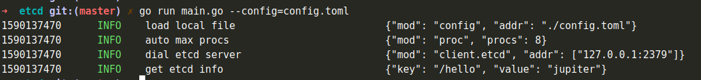

# 4.1 调用ETCD

## 4.1.1 简介
etcd/clientv3 包是用 go 实现的调用 ETCD 服务的客户端。

## 4.1.2 配置规范
[配置说明](http://jupiter.douyu.com/jupiter/6.5clientetcd.html)

```toml
[jupiter.etcdv3.myetcd]
    endpoints = ["127.0.0.1:2379"]
    connectTimeout = "10s"
```
    
## 4.1.3 用法
[调用ETCD示例](https://github.com/douyu/jupiter-examples/tree/main/client/etcd)
```go
func main() {
	client := etcdv3.StdConfig("myetcd").Build()

	ctx, cancel := context.WithTimeout(context.Background(), time.Second*2)
	defer cancel()
	// 添加数据
	_, err := client.Put(ctx, "/hello", "jupiter")
	if err != nil {
		xlog.Panic(err.Error())
	}

	// 获取数据
	response, err := client.Get(ctx, "/hello", clientv3.WithPrefix())
	if err != nil {
		xlog.Panic(err.Error())
	}

	xlog.Info("get etcd info",xlog.String("key",string(response.Kvs[0].Key)),xlog.String("value",string(response.Kvs[0].Value)))
}
```
运行指令``go run main.go --config=config.toml``，可以得到以下结果

按照``Jupiter``的ETCD格式写入配置，然后创建``ETCD``的客户端，就可以很方便的调用``ETCD``。

