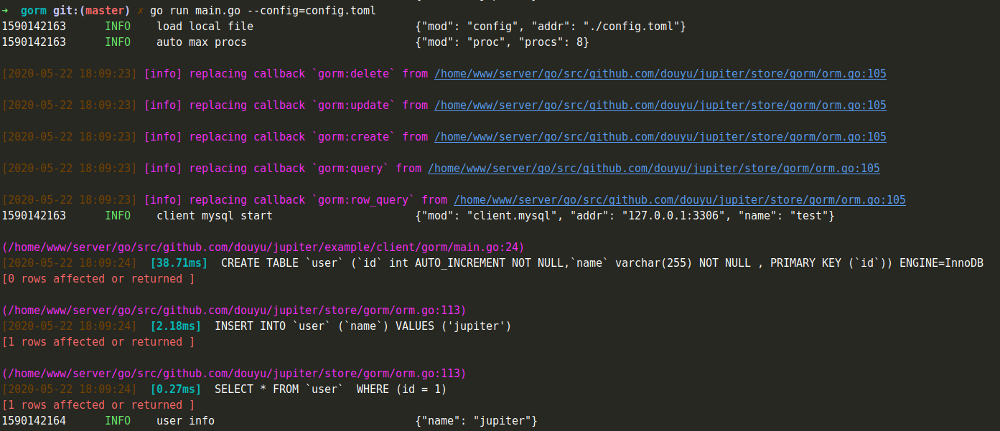

# 4.3 调用Gorm
## 4.3.1 简介

## 4.3.2 配置
[Gorm配置说明](http://jupiter.douyu.com/jupiter/6.7clientgorm.html)
```toml
[jupiter.mysql.test]
   connMaxLifetime = "300s"
   debug = true
   dsn = "root:test@tcp(127.0.0.1:3306)/test?charset=utf8&parseTime=True&loc=Local&readTimeout=1s&timeout=1s&writeTimeout=3s"
   level = "panic"
   maxIdleConns = 50
   maxOpenConns = 100
```

## 4.3.3 用法
```go
type User struct {
	Id   int    `gorm:"not null" json:"id"`
	Name string `gorm:"not null" json:"name"`
}

func main() {
	gormDB := gorm.StdConfig("test").Build()
	models := []interface{}{
		&User{},
	}
	gormDB.SingularTable(true)
	gormDB.Set("gorm:table_options", "ENGINE=InnoDB").AutoMigrate(models...)
	gormDB.Create(&User{
		Name: "jupiter",
	})

	var user User
	gormDB.Where("id = 1").Find(&user)
	xlog.Info("user info",xlog.String("name",user.Name))
}
```
运行指令``go run main.go --config=config.toml``，可以得到以下结果

