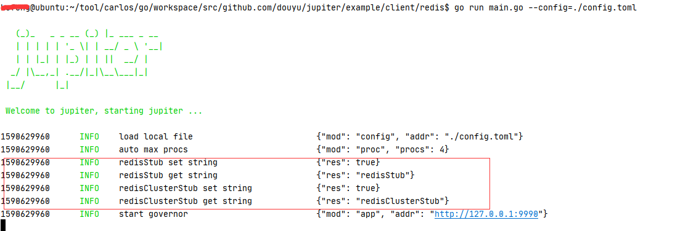

# 4.4 调用Redis

## 4.4.1 简介
client/redis 包是对go-redis 进行二次封装，并提供redisStub和redisClusterStub
两种访问reids方式的客户端

## 4.4.2 配置规范
[配置说明](http://jupiter.douyu.com/jupiter/6.8clientredis.html)


## 4.4.3 用法
[访问redis示例](https://github.com/douyu/jupiter-examples/tree/main/client/redis)

```go
// run: go run main.go --config=config.toml
type Engine struct {
	jupiter.Application
}

func NewEngine() *Engine {
	eng := &Engine{}
	if err := eng.Startup(
		eng.exampleForRedisStub,
		eng.exampleForRedisClusterStub,
	); err != nil {
		xlog.Panic("startup", xlog.Any("err", err))
	}
	return eng
}

func main() {
	app := NewEngine()
	if err := app.Run(); err != nil {
		panic(err)
	}
}

func (eng *Engine) exampleForRedisStub() (err error) {
	//build redisStub
	redisStub := redis.StdRedisConfig("myredis").Build()
	// set string
	setRes := redisStub.Set("jupiter-redis", "redisStub", time.Second*5)
	xlog.Info("redisStub set string", xlog.Any("res", setRes))
	// get string
	getRes := redisStub.Get("jupiter-redis")
	xlog.Info("redisStub get string", xlog.Any("res", getRes))
	return
}
func (eng *Engine) exampleForRedisClusterStub() (err error) {
	//build redisClusterStub
	redisStub := redis.StdRedisClusterConfig("myredis").Build()
	// set string
	setRes := redisStub.Set("jupiter-redisCluster", "redisClusterStub", time.Second*5)
	xlog.Info("redisClusterStub set string", xlog.Any("res", setRes))
	// get string
	getRes := redisStub.Get("jupiter-redisCluster")
	xlog.Info("redisClusterStub get string", xlog.Any("res", getRes))
	return
}

```
执行 go run main.go --config=config.toml,可以看到如下图结果



