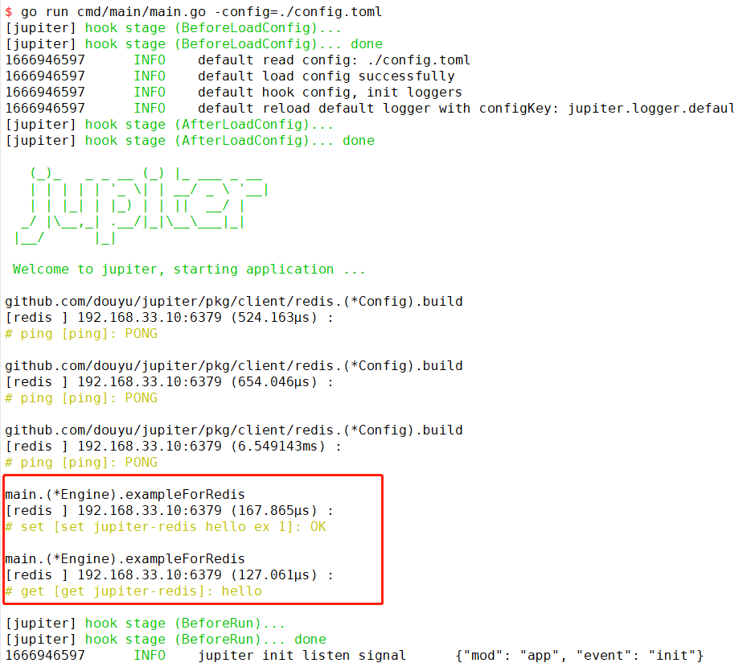

# 4.4 调用Redis

## 4.4.1 简介

client/redis 包是对go-redis v8版本的二次封装，提供主从节点的访问方式，后续视需求提供集群节点的访问方式

## 4.4.2 配置规范

[配置说明](http://jupiter.douyu.com/jupiter/6.8clientredis.html)

## 4.4.3 用法

[访问redis示例](https://github.com/douyu/jupiter-layout/tree/main/internal/pkg/redis)

```go
// run: go run main.go --config=config.toml
package main

import (
    "context"
    "time"

    "github.com/douyu/jupiter"
    "github.com/douyu/jupiter/pkg/client/redis"
    "github.com/douyu/jupiter/pkg/xlog"
)

type Engine struct {
    jupiter.Application
}

func NewEngine() *Engine {
    eng := &Engine{}
    if err := eng.Startup(
        eng.exampleForRedis,
    ); err != nil {
        xlog.Panic("startup", xlog.Any("err", err))
    }
    return eng
}

func main() {
    app := NewEngine()
    if err := app.Run(); err != nil {
        panic(err)
    }
}

func (eng *Engine) exampleForRedis() (err error) {
    //build redisStub
    redisClient := redis.StdConfig("test").MustSingleton()
    // set string
    setRes, _ := redisClient.CmdOnMaster().Set(context.Background(), "jupiter-redis", "hello", time.Second).Result()
    xlog.Info("redis set string", xlog.Any("res", setRes))
    // get string
    getRes, _ := redisClient.CmdOnSlave().Get(context.Background(), "jupiter-redis").Result()
    xlog.Info("redisStub get string", xlog.Any("res", getRes))
    return
}

```

执行 go run main.go --config=config.toml,可以看到如下图结果

