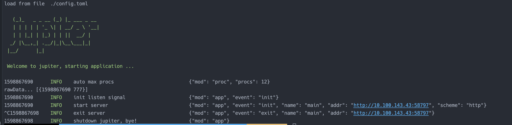

# 4.5 调用MongoDB

## 4.5.1 简介
store/mongox 包是对 `go.mongodb.org/mongo-driver/mongo` 进行二次封装。

## 4.5.2 配置规范
[配置说明](http://jupiter.douyu.com/jupiter/6.9mongodb.html)

## 4.5.3 用法
[访问mongo示例](https://github.com/douyu/jupiter-examples/tree/main/store/mongox)

```go
// run: go run main.go --config=config.toml

package main

import (
	"context"
	"fmt"
	"log"
	"time"

	"github.com/douyu/jupiter"
	"github.com/douyu/jupiter/pkg/store/mongox"
	"github.com/douyu/jupiter/pkg/xlog"
	"go.mongodb.org/mongo-driver/mongo"
	"gopkg.in/mgo.v2/bson"
)

// run: go run main.go -config=config.toml
type Engine struct {
	jupiter.Application
}

func NewEngine() *Engine {
	eng := &Engine{}
	if err := eng.Startup(
		eng.exampleMongo,
	); err != nil {
		xlog.Panic("startup", xlog.Any("err", err))
	}
	return eng
}

func main() {
	app := NewEngine()
	if err := app.Run(); err != nil {
		panic(err)
	}
}

func (eng *Engine) exampleMongo() (err error) {
	client := mongox.StdConfig("test").Build()

	write(client)
	read(client)

	return
}

func write(client *mongo.Client) {
	collection := client.Database("test").Collection("test")

	ctx, cancel := context.WithTimeout(context.Background(), 10*time.Second)
	defer cancel()

	_, err := collection.InsertOne(ctx, bson.M{"rid": 888, "dateline": time.Now().Unix()})
	if err != nil {
		panic(err)
	}
}

func read(client *mongo.Client) {

	collection := client.Database("test").Collection("test")

	ctx, cancel := context.WithTimeout(context.Background(), 10*time.Second)
	defer cancel()

	cur, err := collection.Find(ctx, bson.M{"rid": 888})
	if err != nil {
		log.Fatal(err)
	}
	defer cur.Close(ctx)
	for cur.Next(ctx) {
		var result bson.M
		err := cur.Decode(&result)
		if err != nil {
			xlog.Fatal("exampleMongo", xlog.Any("err", err.Error()))
		}
		fmt.Println("result...", result)

		// do something with result....
	}
}
```
执行 go run main.go --config=config.toml,可以看到如下图结果



