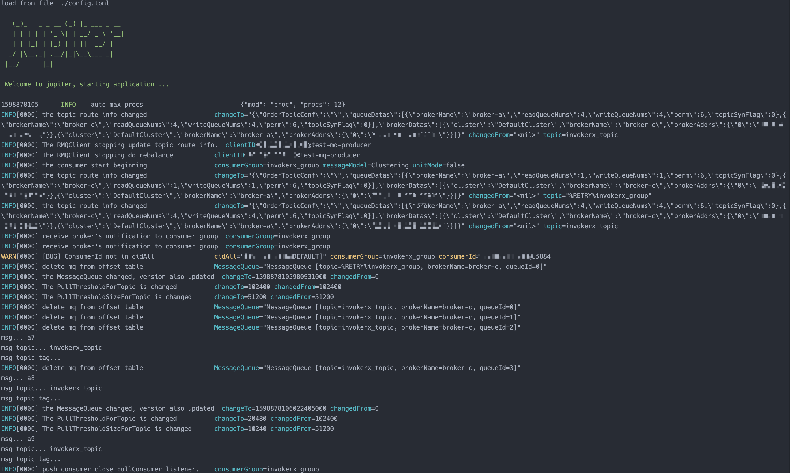

# 4.6 调用RocketMQ

## 4.6.1 简介
client/rocketmq 包是对github.com/apache/rocketmq-client-go/v2 进行二次封装

## 4.6.2 配置规范
[配置说明](http://jupiter.douyu.com/jupiter/6.10rocketmq.html)


## 4.6.3 用法
[访问rocketmq示例](https://github.com/douyu/jupiter-examples/tree/main/client/rocketmq)

```go
// run: go run main.go --config=config.toml

package main

import (
	"context"
	"fmt"
	"strconv"

	"github.com/apache/rocketmq-client-go/v2/primitive"
	"github.com/douyu/jupiter"
	"github.com/douyu/jupiter/pkg/client/rocketmq"
	"github.com/douyu/jupiter/pkg/xlog"
)

// run: go run main.go -config=config.toml
type Engine struct {
	jupiter.Application
}

func NewEngine() *Engine {
	eng := &Engine{}
	if err := eng.Startup(
		eng.exampleRocketMQProducer,
		eng.exampleRocketMQConsumer,
	); err != nil {
		xlog.Panic("startup", xlog.Any("err", err))
	}
	return eng
}

func main() {
	app := NewEngine()
	if err := app.Run(); err != nil {
		panic(err)
	}
}

func (eng *Engine) exampleRocketMQConsumer() (err error) {
	consumerClient := rocketmq.StdPushConsumerConfig("configName").Build()
	defer func() {
		if consumerClient.Enable {
			_ = consumerClient.Close()
		}
	}()
	consumerClient.Subscribe(consumerClient.ConsumerConfig.Topic, func(ctx context.Context, ext *primitive.MessageExt) error {
		fmt.Println("msg...", string(ext.Message.Body))
		fmt.Println("msg topic...", string(ext.Message.Topic))
		fmt.Println("msg topic tag...", string(ext.Message.GetTags()))
		return nil
	})
	err = consumerClient.Start()
	return
}

func (eng *Engine) exampleRocketMQProducer() (err error) {
	producerClient := rocketmq.StdProducerConfig("configName").Build()
	defer func() {
		_ = producerClient.Close()
	}()

	err = producerClient.Start()
	if err != nil {
		return
	}

	for i := 0; i < 10; i++ {
		msg := "a" + strconv.Itoa(i)
		err = producerClient.Send([]byte(msg))
	}
	return
}

```
执行 go run main.go --config=config.toml,可以看到如下图结果



