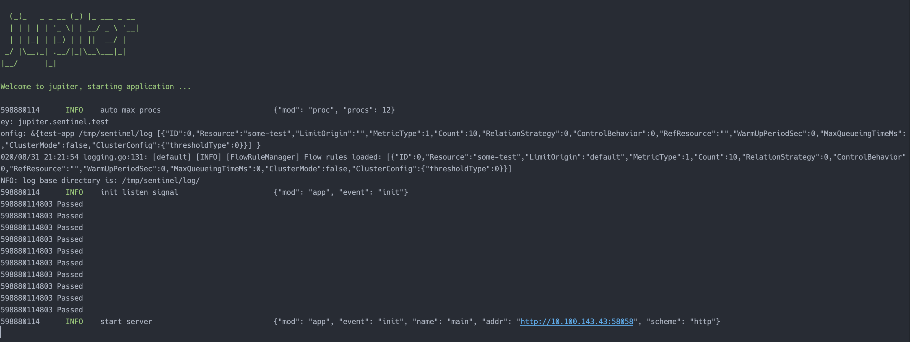

# 4.7 调用Sentinel

## 4.7.1 简介
对官方库的二次封装。

## 4.7.2 配置规范
[配置说明](http://jupiter.douyu.com/jupiter/6.11sentinel.html)


## 4.7.3 用法
[访问redis示例](https://github.com/douyu/jupiter-examples/tree/main/sentinel)

```go
// run: go run main.go --config=config.toml

package main

import (
	"fmt"
	"math/rand"
	"time"

	"github.com/douyu/jupiter/pkg/util/xgo"
	"github.com/douyu/jupiter"
	"github.com/douyu/jupiter/pkg/sentinel"
	"github.com/douyu/jupiter/pkg/util/xtime"
	"github.com/douyu/jupiter/pkg/xlog"
)

type Engine struct {
	jupiter.Application
}

func NewEngine() *Engine {
	eng := &Engine{}
	if err := eng.Startup(
		eng.exampleSentinel,
	); err != nil {
		xlog.Panic("startup", xlog.Any("err", err))
	}
	return eng
}

func main() {
	app := NewEngine()
	if err := app.Run(); err != nil {
		panic(err)
	}
}

func (eng *Engine) exampleSentinel() (err error) {
	err = sentinel.StdConfig("test").Build()
	if err != nil {
		panic(fmt.Sprintf("sentinel init failed: %s", err.Error()))
	}

	for k := 0; k < 20; k++ {
		xgo.Go(func() {
			e, b := sentinel.Entry("some-test")
			if b != nil {
				// 请求被拒绝，在此处进行处理
				time.Sleep(time.Duration(rand.Uint64()%10) * time.Millisecond)
			} else {
				// 请求允许通过，此处编写业务逻辑
				fmt.Println(xtime.CurrentTimeMillis(), "Passed")
				time.Sleep(time.Duration(rand.Uint64()%10) * time.Millisecond)

				// 务必保证业务结束后调用 Exit
				e.Exit()
			}
		})
	}

	return
}

```
执行 go run main.go --config=config.toml,可以看到如下图结果



