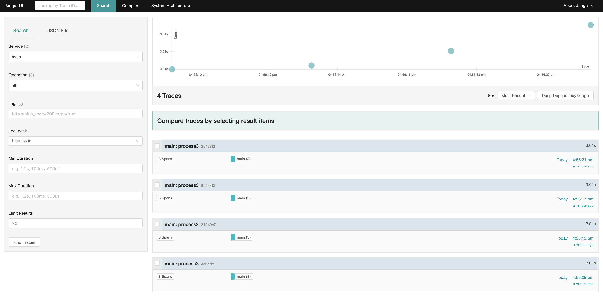
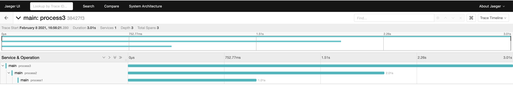

# 4.8 调用Trace

## 4.8.1 环境准备

[jaeger参考文档](https://www.jaegertracing.io/docs/1.21/getting-started/) 


本地测试需要安装jaegertracing，推荐直接使用docker方式启动。
> docker pull jaegertracing/all-in-one 


安装完成后访问 [http://localhost:16686/](http://localhost:16686/) 可以看到ui界面。

## 4.8.2 基本说明
在服务启动的配置文件中加入如下配置后，jupiter 应用启动之后会开启 trace 功能。如果没有配置 LocalAgentHostPort 参数，应用会读取环境变量`JAEGER_AGENT_ADDR`。
```
[jupiter.trace.jaeger]
EnableRPCMetrics= true
[jupiter.trace.jaeger.Reporter]
LocalAgentHostPort = "127.0.0.1:6831"
LogSpans = true
[jupiter.trace.jaeger.Sampler]
Param = 0.0001
```
trace数据写入方式

```go
span, ctx := trace.StartSpanFromContext(ctx, "process1")
defer span.Finish()
```

## 4.8.2 使用方案

example地址 [https://github.com/douyu/jupiter-examples/tree/main/trace](https://github.com/douyu/jupiter-examples/tree/main/trace)

## 4.8.3 实际效果




